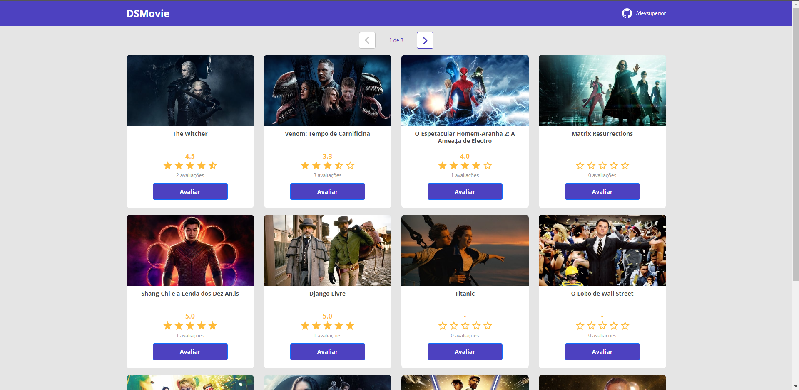
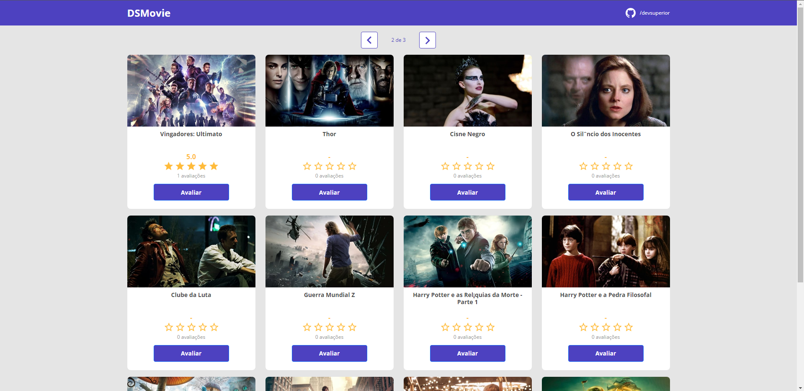
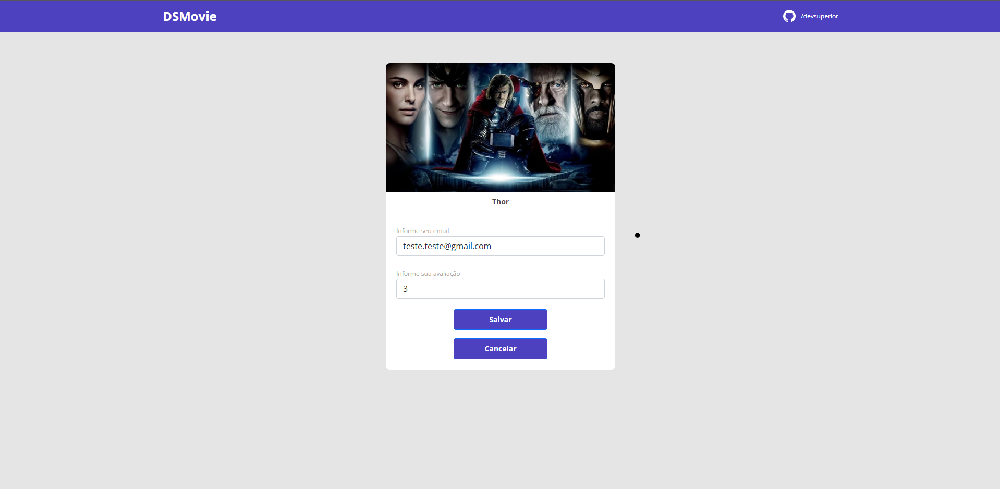
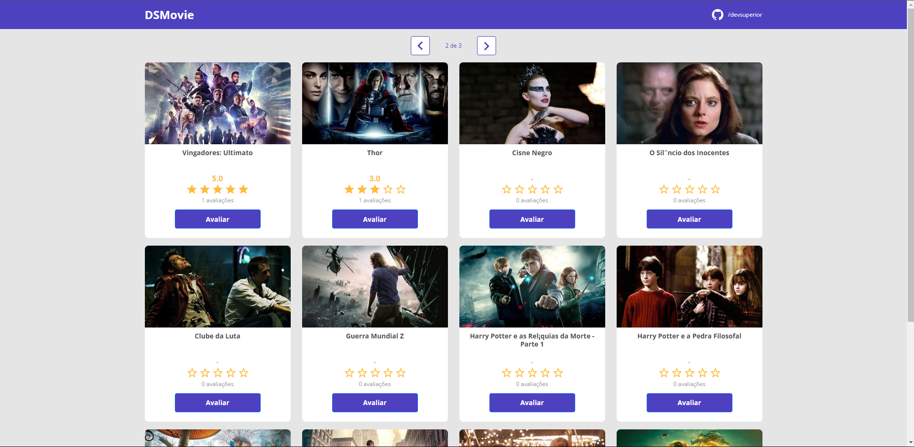

# DSMOVIE

# Sobre o projeto

Aplicação web que lista lançamentos de filmes com as notas dadas pelos usuários e tambem recebe novas notas. 

### Explicação do sistema

- Na página principal é listado varios cards com informações sobre os filmes

- Um componente de paginação auxilia a ver todos filmes cadastrados

- Quando clicado o botão de avaliar uma nova página é carregada

- O usuário insere email e nota para o filme e pronto ao atualizar a página princial a nova nota é contabilizada

### Tela de Filmes


### Tela de Filmes página 2 


### Tela de Avaliar Filme


### Tela de Filmes atualizada


# 🚀 Começando

Essas instruções permitirão que você obtenha uma cópia do projeto em operação na sua máquina local para fins de desenvolvimento e teste.

## 📋 Pré-requisitos

- npm / yarn
- postgres
- jdk ver: 17
- springtoolsuite4

## 🔧 Instalação
### :warning::warning: **A pasta imgs**: é para guardar as imagens usadas no readme.md! Apagar ela depois do clone :warning::warning:

``` bash
## clonar repositório
git clone https://github.com/PauloCSantos/dsmovie.git

## iniciar o terminal do postgres
psql -U postgres
colocar a senha criada na instalação do postgres

## criar o banco de dados
CREATE DATABASE dsmovie

# no diretório frontend

## entrar na pasta do projeto no terminal
cd frontend

## instalar as dependencias
npm i

## executar o projeto
npm start

# no diretório backend
abrir o diretório no springtoolsuite4

## no pacote resources encontrar o arquivo application-dev.properties
preencher o username e password com o usuario e senha cadastrado no postgres

## executar o backend
aperte para executar o spring
```

## 🛠️ Construído com

- React
- Bootstrap
- TypeScript
- Java
- SpringBoot
- PostgreSQL

## ✒️ Autor

* **Paulo C Santos** - [Linkedin](https://www.linkedin.com/in/paulocsantos1995/)

## 🖐️ Agradecimento

Agradeço ao professor Nélio Alves pelo curso. Foram vários dias de aprendizado e muita mão na massa

- Link da DevSuperior: https://devsuperior.com.br/cursos
